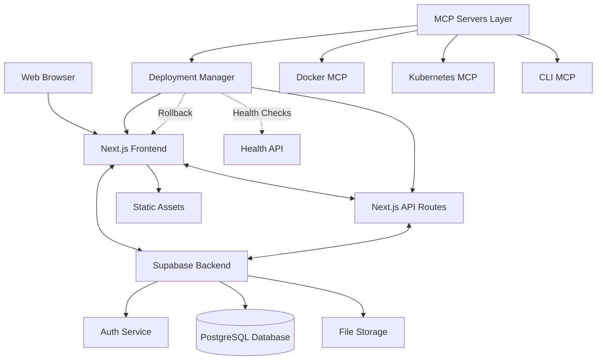

# Teaching Scheduler 6 Architecture

## Overview

Teaching Scheduler 6 is a modern web application for scheduling and managing teaching resources. It is built with Next.js and uses Supabase for backend services.

## System Architecture

## Component Breakdown

### Frontend

The frontend is built with Next.js and uses React for UI components. It follows these architectural patterns:

1. **App Router**: Uses the latest Next.js App Router for routing
2. **Server Components**: Leverages React Server Components for improved performance
3. **Client Components**: Uses Client Components for interactive elements
4. **Data Fetching**: Server-side data fetching for improved SEO and performance
5. **Error Boundaries**: Comprehensive error handling with automated retry mechanisms
6. **Connection Status**: Real-time connection status monitoring and indicators

### Backend

The backend is provided by Supabase, which offers:

1. **Authentication**: JWT-based authentication with various providers
2. **Database**: PostgreSQL database with Row Level Security
3. **Storage**: File storage with access controls
4. **Realtime**: Realtime subscriptions for live updates

### API Layer

The application uses Next.js API routes to provide server-side functionality:

1. **Database Access**: Controlled access to the database
2. **External Services**: Integration with external services
3. **Health Checks**: Enhanced health check endpoints for monitoring and deployment verification
4. **Authentication**: JWT validation and session management

## Deployment Architecture

The application is deployed using a CI/CD pipeline with GitHub Actions. The deployment architecture includes:

### MCP Server Integration

The application integrates with Model Context Protocol (MCP) servers to enhance deployment capabilities:

1. **Docker MCP Server**: Manages Docker-based deployments for development and staging
2. **Kubernetes MCP Server**: Orchestrates production deployments to Kubernetes clusters
3. **CLI MCP Server**: Provides secure script execution capabilities for deployment tasks
4. **Deployment Manager MCP Server**: Coordinates deployment lifecycle including verification and rollback

### Deployment Environments

The application supports multiple deployment environments:

1. **Development**: Local development environment with hot-reloading
2. **Staging**: Pre-production environment for testing
3. **Production**: Production environment with high availability

### Automated Deployment Process

The deployment process includes:

1. **Build**: Automated building of the application
2. **Test**: Comprehensive testing before deployment
3. **Deploy**: Deployment to the target environment
4. **Verify**: Health checks to verify successful deployment
5. **Rollback**: Automatic rollback on deployment failure

## Health Check System

The application includes an enhanced health check system for monitoring and deployment verification:

### Health Check API

Located at `/api/health`, the health check API provides:

1. **Application Status**: Basic up/down status
2. **Database Connection**: Detailed Supabase connection status
3. **Version Information**: Current application version
4. **Uptime**: Application uptime statistics
5. **Environment**: Current environment information
6. **System Resources**: System resource utilization
7. **Detailed Diagnostics**: Optional detailed diagnostics mode

### Connection Status Monitoring

The application includes real-time connection status monitoring:

1. **Status Indicator**: Visual indicator of connection status
2. **Automatic Retry**: Retry logic for failed connections
3. **Offline Mode**: Graceful degradation in offline mode
4. **User Notifications**: User-friendly notifications of connection issues

## Deployment Manager

The Deployment Manager is a centralized system for managing the deployment lifecycle:

### Features

1. **Deployment Tracking**: Records all deployments with version history
2. **Health Verification**: Verifies deployments through health checks
3. **Rollback Management**: Automatic and manual rollback capabilities
4. **Notification System**: Alerts on deployment status and failures

### Deployment Records

The Deployment Manager maintains records of:

1. **Version**: Application version
2. **Timestamp**: Deployment time
3. **Environment**: Target environment
4. **Status**: Deployment status
5. **Health**: Health check results
6. **Rollback Information**: Records of any rollbacks

## Data Flow

The application follows these data flow patterns:

1. **Server-side Rendering**: Data is fetched on the server for initial page load
2. **Client-side Updates**: Interactive elements update data on the client
3. **Realtime Updates**: Subscriptions provide realtime updates
4. **Offline Support**: Application can function in offline mode with fallback data

## Security Architecture

The application implements several security measures:

1. **Authentication**: JWT-based authentication with Supabase
2. **Authorization**: Row Level Security for database access
3. **Input Validation**: Server-side validation of all inputs
4. **Content Security**: Content Security Policy headers
5. **Secure Deployment**: Restricted execution environment for deployment scripts

## Error Handling and Resilience

The application includes comprehensive error handling:

1. **Error Boundaries**: React Error Boundaries to prevent cascading failures
2. **Retry Logic**: Automatic retry with exponential backoff
3. **Fallback UI**: Graceful degradation with fallback UI
4. **Connection Recovery**: Automatic recovery from connection issues
5. **Deployment Resilience**: Automatic rollback on deployment failure

## Future Architectural Evolution

Planned architectural enhancements include:

1. **Microservices**: Breaking down the application into microservices
2. **Edge Computing**: Leveraging edge computing for improved performance
3. **Enhanced Monitoring**: More comprehensive monitoring and alerting
4. **Multi-region Deployment**: Support for multi-region deployment
5. **Canary Deployments**: Gradual rollout of new versions 