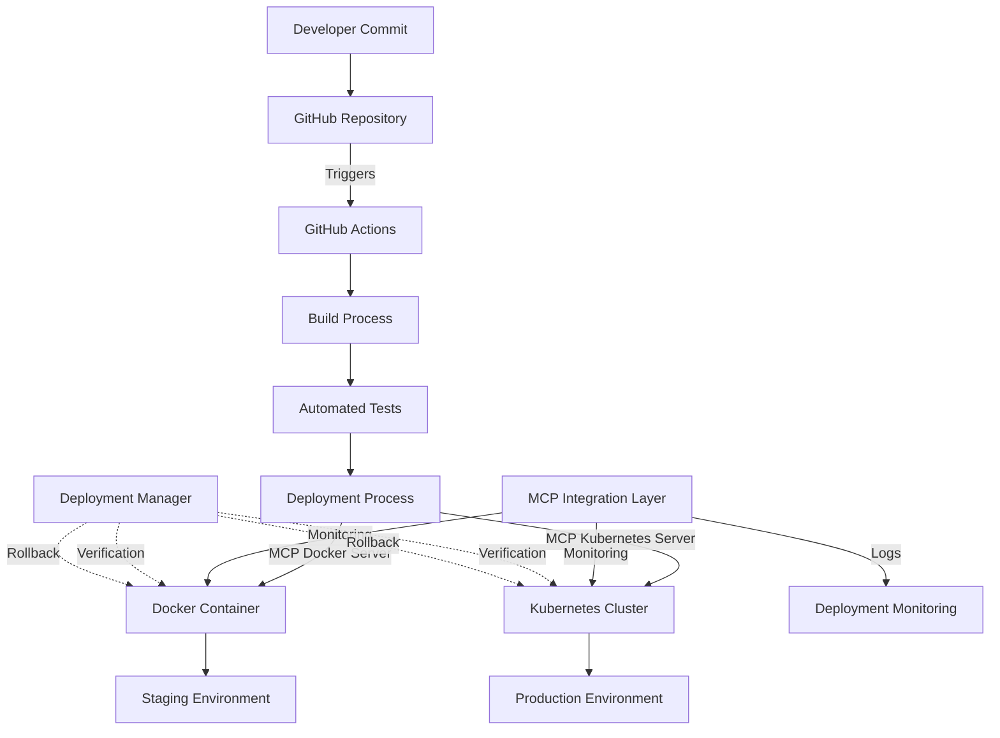

# Automated Deployment Strategy

## Overview

This document outlines the automated deployment strategy for the Teaching Scheduler application, utilizing Model Context Protocol (MCP) servers to streamline the CI/CD pipeline and DevOps processes. The strategy focuses on ensuring reliable, reproducible deployments with minimal manual intervention.

## Deployment Architecture



## MCP Servers for Deployment

The Teaching Scheduler implementation leverages several MCP servers to automate and enhance the deployment process:

### 1. Docker MCP Server

**Purpose**: Manage Docker container creation, deployment, and monitoring for development and staging environments.

**Setup**:
```json
{
  "mcpServers": {
    "docker-mcp": {
      "command": "uvx",
      "args": ["docker-mcp"],
      "env": {
        "DOCKER_HOST": "unix:///var/run/docker.sock",
        "MCP_PORT": "3002"
      }
    }
  }
}
```

**Implementation**:
- Multi-stage Dockerfile for optimal production builds
- Development and production docker-compose configurations
- Health check API endpoint for container monitoring
- Deployment and cleanup scripts for container management

**Capabilities**:
- Create and manage Docker containers for the application
- Deploy Docker Compose stacks for multi-container setups
- Monitor container logs and performance
- Automated container health checks
- Support for rolling updates

### 2. Kubernetes MCP Server

**Purpose**: Orchestrate deployment to Kubernetes clusters for production environment.

**Setup**:
```json
{
  "mcpServers": {
    "kubernetes": {
      "command": "npx",
      "args": ["mcp-server-kubernetes"]
    }
  }
}
```

**Capabilities**:
- Manage Kubernetes deployments, services, and pods
- Handle rolling updates with zero downtime
- Configure resource allocations and scaling
- Monitor deployment health and status
- Integrate with Helm for package management

### 3. CLI MCP Server

**Purpose**: Execute controlled command-line operations during deployment.

**Setup**:
```json
{
  "mcpServers": {
    "cli-mcp-server": {
      "command": "uvx",
      "args": ["cli-mcp-server"],
      "env": {
        "ALLOWED_DIR": "/deployment/scripts",
        "ALLOWED_COMMANDS": "npm,node,bash,echo,curl,docker,docker-compose",
        "MAX_COMMAND_LENGTH": "2048",
        "COMMAND_TIMEOUT": "300"
      }
    }
  }
}
```

**Implementation**:
- Deployment script for Docker container setup
- Cleanup script for managing resources
- Restricted command execution for security

**Capabilities**:
- Execute deployment scripts securely
- Perform health checks and verification
- Run database migrations
- Clear caches and perform maintenance tasks
- Generate deployment reports

### 4. Deployment Manager MCP Server

**Purpose**: Manage deployment lifecycle, including verification and automatic rollback.

**Setup**:
```json
{
  "mcpServers": {
    "deployment-manager": {
      "command": "node",
      "args": ["deployment-manager.js"],
      "env": {
        "DEPLOYMENT_MANAGER_PORT": "3005"
      }
    }
  }
}
```

**Implementation**:
- Tracks deployment history across environments
- Verifies health status of deployments
- Performs automatic rollbacks when necessary
- Maintains a record of all deployments and rollbacks

**Capabilities**:
- Deploy new versions to staging and production
- Verify deployments via health checks
- Rollback to previous versions on failure
- Track and report on deployment history
- Provide unified interface for Docker and Kubernetes environments

## Docker Configuration

The Docker configuration for the Teaching Scheduler application includes:

### Dockerfile

Located at `docker/Dockerfile`, it uses a multi-stage build approach:
1. **deps stage**: Installs dependencies
2. **builder stage**: Builds the Next.js application
3. **runner stage**: Creates a minimal production image

Key features:
- Alpine-based Node.js image for smaller size
- Non-root user for enhanced security
- Optimized for Next.js applications
- Proper caching of dependencies

### Docker Compose Files

Two Docker Compose configurations are provided:

1. **Development** (`docker/docker-compose.yml`):
   - Hot-reloading for development
   - Volume mounts for local code
   - MCP Console server for monitoring
   - Docker MCP server for container management

2. **Production** (`docker/docker-compose.prod.yml`):
   - Optimized for production use
   - Health checks for reliability
   - Resource limits for stability
   - Logging configuration
   - Replica management for scaling

### Deployment Scripts

Scripts in the `scripts` directory handle Docker operations:

1. **docker-deploy.sh**:
   - Builds and tags the Docker image
   - Deploys using docker-compose
   - Validates environment variables
   - Checks deployment status

2. **docker-cleanup.sh**:
   - Stops and removes containers
   - Optionally prunes images and volumes
   - Supports different environments

## CI/CD Pipeline

Our CI/CD pipeline leverages GitHub Actions in combination with MCP servers to automate the entire deployment process:

### 1. Build Phase
- Triggered by commits to main branch or pull request merges
- Builds the application with optimized production settings
- Creates Docker images for deployment
- Publishes images to container registry

### 2. Test Phase
- Runs comprehensive test suite (unit, integration, end-to-end)
- Performs static code analysis and security scans
- Validates database migrations
- Ensures Supabase "iWorld Scheduler" connection integrity

### 3. Deployment Phase
- **Staging Environment**:
  - Automated deployment to staging using Docker MCP Server
  - Runs smoke tests to verify basic functionality
  - Captures deployment logs for verification
  - Records deployment in history for potential rollback
  
- **Production Environment**:
  - Scheduled deployment to production using Kubernetes MCP Server
  - Implements blue-green deployment for zero downtime
  - Performs automatic rollback on failure
  - Sends deployment notifications to team
  - Maintains deployment history for auditing and rollback

## Monitoring and Rollback

The MCP servers provide robust monitoring and automatic rollback capabilities:

1. **Health Monitoring**:
   - Continuous checking of container and service health
   - Enhanced API endpoint verification
   - Database connection validation
   - Performance metrics collection
   - Historical status tracking

2. **Automatic Rollback**:
   - Health check failure triggers immediate rollback
   - Restores previous stable version
   - Logs failure details for debugging
   - Notifies development team via configured channels
   - Maintains rollback history for auditing

3. **Deployment Verification**:
   - Enhanced health check API with detailed diagnostics
   - Smoke tests run post-deployment
   - Gradually increases traffic to new deployment
   - Monitors error rates and performance
   - Confirms Supabase integration functionality

## Development Workflow

Developers follow this workflow to ensure smooth deployments:

1. **Local Development**:
   - Develop and test locally using Docker MCP Server
   - Verify changes against Supabase "iWorld Scheduler"
   - Run local test suite before pushing

2. **Pull Request**:
   - Create PR against main branch
   - Automated CI runs tests and validation
   - Review process includes deployment preview

3. **Merge and Deploy**:
   - Merge to main branch triggers staging deployment
   - Verify functionality in staging environment
   - Schedule production deployment through release process

4. **Production Release**:
   - Approved releases deployed to production
   - Monitored release with progressive traffic routing
   - Performance baselines established and monitored

## Health Checks

The application includes an enhanced health check API endpoint at `/api/health` that:
- Returns basic application status
- Checks Supabase connection in detail
- Provides uptime and version information
- Reports system resource usage
- Returns process metrics
- Supports detailed diagnostics mode
- Is used by Docker and Kubernetes for container health monitoring

### Health Check API

The health check API provides the following information:

```json
{
  "status": "ok",
  "timestamp": "2023-03-22T12:34:56.789Z",
  "version": "1.0.0",
  "uptime": 3600,
  "environment": "production",
  "database": {
    "status": "connected",
    "isOffline": false
  },
  "system": {
    "platform": "linux",
    "cpus": 4,
    "memory": {
      "total": 8589934592,
      "free": 4294967296,
      "usage": 50
    }
  }
}
```

Additional diagnostic information is available by adding the `detailed=true` parameter to the request.

## Disaster Recovery

In case of deployment failures, the system provides these recovery mechanisms:

1. **Automated Rollback**:
   - Failed health checks trigger immediate rollback
   - Previous working version restored within minutes
   - Error logs captured for analysis
   - Deployment history tracked for auditing

2. **Manual Intervention**:
   - CLI MCP Server allows secure manual operations if needed
   - Access to deployment logs and diagnostics
   - Ability to force rollback or emergency fixes
   - Deployment history available for reference

3. **Data Recovery**:
   - Regular backups of application state
   - Backup verification as part of deployment
   - Restoration procedures documented and tested

## Deployment Manager

The Deployment Manager MCP Server provides a centralized system for managing the deployment lifecycle:

1. **Deployment Tracking**:
   - Records all deployments to staging and production
   - Maintains version history
   - Tracks deployment status
   - Provides an audit trail for compliance

2. **Health Verification**:
   - Verifies deployments through health checks
   - Monitors application status
   - Detects failures quickly
   - Provides detailed diagnostics

3. **Rollback Management**:
   - Automatic rollback on failed deployments
   - Manual rollback capability
   - Rollback history tracking
   - Version comparison for decision making

4. **Notification System**:
   - Alerts on deployment status
   - Notifies teams of failures
   - Provides deployment reports
   - Integrates with Slack and email

## Future Enhancements

Planned enhancements to the deployment process include:

1. **Canary Deployments**:
   - Implement fine-grained traffic control for new deployments
   - Automated performance comparison between versions
   - Gradual rollout based on metrics

2. **Enhanced Monitoring**:
   - Integrate additional MCP servers for comprehensive monitoring
   - Real-time performance dashboards
   - User experience monitoring and alerting

3. **Multi-Region Deployment**:
   - Extend Kubernetes MCP Server capabilities for multi-region deployments
   - Global traffic routing and load balancing
   - Region-specific configuration management 